# SatsPath

**Open-source Bitcoin payment discovery and routing infrastructure.**

> **One human-readable Bitcoin identity. Compatible wallets. Multiple payment rails. Wallet-controlled custody.**

[](https://github.com/satspath/satspath/actions/workflows/ci.yml)
[](LICENSE)

---

## 60–90 Second Executive Summary

### What is SatsPath?
SatsPath is an open-source discovery and verification layer for human-readable Bitcoin payment identities. It resolves a single recipient identifier (e.g. `alice@example.com`) to an authenticated profile, discovers advertised payment capabilities, and formats a wallet handoff for the sender's host wallet.

### What Problem Does it Solve?
Bitcoin users face a fragmented landscape of payment identifiers:
* **Lightning Addresses** (`user@domain.com`) & **LNURL-pay** links
* **BOLT12 Offers** (`lno1...`)
* **On-Chain Addresses** (SegWit, Taproot) & **BIP-21 URIs**
* **BIP-353 DNS Names** (`₿user@domain.com`)
* **Silent Payments** (`sp1...`)
* **Ark Payment Pointers**
* **Nostr Pubkeys / NIP-05**

Different wallets support different subsets of these mechanisms. Today, paying someone in Bitcoin requires knowing in advance which rail the recipient supports, whether channel liquidity is available, or whether fee conditions make on-chain settlement practical.

### How SatsPath Works

```text
Human-readable identifier (alice@example.com)
       ↓
Multi-transport resolution (HTTPS / Nostr / BIP-353 / S2S)
       ↓
Cryptographic verification (BIP-340 Schnorr signature, expiry, Merkle inclusion)
       ↓
Capability discovery (Lightning, BOLT12, on-chain, Silent Payments, Ark)
       ↓
Reference route selection (amount, multi-source fee consensus, priority)
       ↓
Wallet handoff payload (BIP-21 URI, BOLT11 invoice, BOLT12 offer, Ark pointer)
       ↓
Host wallet signs and executes the payment
```

### Why Isn't Lightning Address Alone Enough?
A Lightning Address (`user@domain.com`) exclusively targets a Lightning receiving node. If the receiver's node is offline, channel liquidity is exhausted, or the transaction amount exceeds capacity, the payment fails. SatsPath can consume Lightning Addresses while advertising on-chain addresses, BOLT12 offers, Silent Payments, and Ark pointers as dynamic fallbacks.

### Why Isn't BIP-353 Alone Enough?
[BIP-353](https://github.com/bitcoin/bips/blob/master/bip-0353.mediawiki) maps `₿user@domain.com` to payment instructions via DNS TXT records. However, BIP-353 requires control of, or cooperation from, the DNS zone or provider hosting the recipient's domain. Users with standard email addresses (e.g. `alice@gmail.com`) cannot publish arbitrary DNS records on their provider's zone without administrative integration. SatsPath supports BIP-353 as a resolver backend, while providing alternative transports (HTTPS S2S, Nostr NIP-05), key continuity tracking, and transparency logs.

### What Does SatsPath Trust?
* **Namespace Authorities (DNS, WebPKI, Platforms):** Acknowledged as having authority to assign, revoke, or censor names. They cannot, however, forge cryptographic identity signatures without detection.
* **Initial Contact (TOFU):** First-contact identity authentication relies on Trust-On-First-Use unless the namespace-to-key binding is independently verified out-of-band or through another trusted identity anchor. Witness quorums can improve consistency and split-view detection but do not by themselves authenticate the initial binding.
* **Log Operators & Witnesses:** Monitored via append-only Merkle logs and $K$-of-$N$ Schnorr witness quorums to detect split views and rollbacks.

### Who Holds the Private Keys?
**Host wallets hold all private spending keys.** SatsPath does not have, never generates, and never requests private spending keys or seed phrases. SatsPath holds only a non-custodial `secp256k1` identity keypair used exclusively to sign public metadata profiles and rotation records.

### What Works Today, What is Experimental, and What Has Not Been Audited?
* **Implemented Today:** Signed profiles, key rotation, HTTPS/Nostr resolvers, multi-source fee consensus, append-only Merkle transparency log, sparse Merkle state map, and witness quorum cosigning.
* **Preview / Experimental:** BIP-353 (Preview; strict DNSSEC fails closed without local validator), BOLT12 (Experimental / Partial; prototype TLV, offer-handling, and blinded-path primitives exist; standards-conformant checksumless BOLT12 string decoding, invoice-request construction, Merkle signing, and CLN/LDK interop remain incomplete), Silent Payments (Experimental; primitives and address/output construction implemented; standards conformance and mainnet interoperability are not claimed until the official BIP-352 test vectors pass), Ark routing (Preview; ASP rounds simulated).
* **Audit Status:** SatsPath has completed internal test suites and automated adversarial simulations, but has **NOT yet undergone an independent third-party cryptographic or security audit**.

Website: <https://satspath.com>

---

## Non-Custodial Architecture: A Security Invariant

**SatsPath does not have, and never requests, the user's private spending keys.**

This is an intentional **security property**:

```mermaid
flowchart LR
    subgraph Discovery ["SatsPath (Discovery & Verification Layer)"]
        A[Recipient Identifier] --> B[Resolver Chain]
        B --> C[Profile Signature Verification]
        C --> D[Capability Discovery & Routing]
        D --> E[Wallet Handoff Payload]
    end

    subgraph Wallet ["User's Host Wallet (Sovereign Custody)"]
        E --> F[Display Payment Prompt]
        F --> G[Inspect Amounts & Dest]
        G --> H[Sign with Private Spending Key]
        H --> I[Broadcast to Bitcoin / Lightning]
    end

    classDef sats fill:#d4edda,stroke:#28a745,stroke-width:2px;
    classDef wallet fill:#cfe2ff,stroke:#0d6efd,stroke-width:2px;
    class A,B,C,D,E sats;
    class F,G,H,I wallet;
```



* **No Custody of Funds:** SatsPath does not custody, seize, freeze, or hold user funds.
* **No Seed Phrases:** SatsPath never handles BIP-39 seeds, xprv/tprv keys, or node credentials.
* **Identity Keys Carry No Funds:** The `secp256k1` identity keypair is used exclusively to sign public profiles, authorization statements, and key rotations.
* **Wallet Retains Final Authority:** The host wallet inspects payment instructions, presents them to the user, signs with internal spending keys, and broadcasts directly to the network.
* **Custody Risk vs. Payment Redirection Risk:** Compromising SatsPath does not directly expose wallet spending keys or authorize Bitcoin transactions. However, a compromised discovery or handoff component may attempt payment redirection, which is why authenticated profiles, key continuity, resolver verification, and wallet-side confirmation of amounts and destinations remain security-critical.

---

## Maturity Taxonomy

To provide unambiguous expectations, capabilities and components in this repository are categorized under this taxonomy:

* **IMPLEMENTED:** Functionality exists in the current codebase and is exercised by automated unit, integration, or simulation tests.
* **PREVIEW:** Usable implementation exists, but protocol interoperability, API stability, or production hardening is incomplete.
* **EXPERIMENTAL:** Early implementation subject to significant change and not recommended for production reliance.
* **RESEARCH:** Prototype or exploratory work investigating future cryptographic or architectural primitives.
* **PLANNED:** Designed architecture not yet implemented in code.

---

## Verified Capability Matrix

This table reflects the actual status of the codebase (`crates/`) verified by unit, integration, and security simulation tests.

| Capability | Current Status | Architectural Details & Limitations |
| :--- | :--- | :--- |
| **Signed Payment Profiles** | **IMPLEMENTED** | Canonical JSON (RFC 8785), domain-separated `secp256k1` Schnorr signatures (`BIP-340`), monotonic sequence and expiry validation. |
| **Key Continuity & Rotation** | **IMPLEMENTED** | Dual-signed rotation transitions (`AuthorizationV1` signed by old key, `AcceptanceV1` by new key) bound to canonical history. |
| **HTTPS S2S Resolver** | **IMPLEMENTED** | Resolves signed profiles over HTTPS (`.well-known/satspath-authority`). URL validation blocks known unsafe schemes, ports, hosts, and private/reserved IP addresses. The SSRF guard resolves hostnames, rejects any that map to internal addresses, and pins the connection to the validated IPs, closing the DNS-rebinding window. |
| **Nostr Resolver** | **IMPLEMENTED** | NIP-05 pubkey lookup and kind `30078` event fetching; verifies SatsPath profile signature independently of Nostr relay signatures. |
| **BIP-353 DNS Resolver** | **PREVIEW** | BIP-353 support is currently Preview. Record parsing and strict DNSSEC policy enforcement are implemented. The default DoH backend does not independently validate the DNSSEC chain; Strict mode therefore requires authenticated DNSSEC results and fails closed otherwise. |
| **Lightning Address / LNURL** | **IMPLEMENTED** | Resolves public metadata and requests concrete BOLT11 invoices for wallet handoff. |
| **BOLT12 Offers & Blinded Paths**| **EXPERIMENTAL (Partial)** | Prototype TLV, offer-handling, and blinded-path primitives exist (`crates/satspath-router/src/bolt12.rs`), but standards-conformant checksumless BOLT12 string decoding, invoice-request construction, Merkle signing, and interoperability with implementations such as Core Lightning and LDK remain incomplete. |
| **On-Chain / BIP-21** | **IMPLEMENTED** | Network address validation (mainnet, testnet, regtest), dynamic fee estimation, and `bitcoin:` BIP-21 URI formatting. |
| **Silent Payments (BIP-352)** | **EXPERIMENTAL** | Experimental BIP-352 primitives and address/output construction are implemented (`crates/satspath-router/src/silent_payments.rs`). Standards conformance and mainnet interoperability are not claimed until the official BIP-352 test vectors pass. |
| **Multi-Source Fee Consensus** | **IMPLEMENTED** | Concurrent queries across Bitcoin Core RPC, Esplora, and Mempool.space with median filtering and decaying cache fallback (`crates/satspath-router/src/fees.rs`). |
| **S2S v2 Transparency Log** | **IMPLEMENTED** | Append-only Merkle event log, RFC 6962-style compact consistency proofs, and signed operator checkpoints (`crates/satspath-core/src/transparency.rs`). |
| **Authenticated State Map** | **IMPLEMENTED** | Sparse Merkle tree generating cryptographic non-inclusion proofs, bound to checkpoint root (`crates/satspath-core/src/state_map.rs`). |
| **Witness Quorum Cosigning** | **IMPLEMENTED** | Standalone witness node (`crates/satspath-witness`) performing $K$-of-$N$ Schnorr cosigning, consistency verification, and local rollback/equivocation detection. |
| **Ark Payment Routing** | **PREVIEW** | Receive pointer parsing and route scoring exist; live Ark ASP VTXO round execution is simulated (`crates/satspath-router/src/ark.rs`). |
| **Submarine / Reverse Swaps** | **EXPERIMENTAL** | Boltz Exchange v2 client, AES-256-GCM encrypted store, and claim/refund tx builders for testnet/regtest only (`crates/satspath-swaps`). |
| **Post-Quantum Cryptography** | **RESEARCH** | Hybrid signature module (`secp256k1` + ML-DSA-65) in `crates/satspath-pqc`. Research primitive; not part of production safety claim. |
| **Mainnet Payment Execution** | **DELIBERATELY UNSUPPORTED** | SatsPath can discover and validate selected mainnet payment capabilities and hand compatible instructions to a wallet. Wallet-controlled software remains responsible for authorization, signing, and payment execution. |

---

## SatsPath in the Bitcoin Ecosystem

### Why Not Just Use a Lightning Address?
A Lightning Address (`user@domain.com`) is a protocol that maps an email-like alias to an HTTP LNURL-pay endpoint to fetch a BOLT11 invoice:
* **Scope:** A Lightning Address exclusively routes to a Lightning receiving node. If the receiver's node is offline, channel liquidity is depleted, or the transaction amount exceeds channel capacity, the payment fails.
* **SatsPath Complementarity:** SatsPath does not replace Lightning Addresses—it can consume them. A SatsPath profile can advertise a Lightning Address alongside on-chain addresses, BOLT12 offers, Silent Payments, and Ark pointers. The router dynamically selects the optimal rail based on live fees and transaction size.
* **Conceptually:**
  * *Lightning Address:* Identifier → Lightning Node
  * *SatsPath:* Identifier → Authenticated Identity Profile → Available Capabilities → Compatible Rail → Wallet Handoff

### How Does SatsPath Relate to BIP-353?
[BIP-353](https://github.com/bitcoin/bips/blob/master/bip-0353.mediawiki) establishes human-readable Bitcoin payment instructions via DNS TXT records (`₿user@domain.com`):
* **SatsPath Interoperability:** SatsPath supports BIP-353 as one of its resolver backends. A SatsPath client can resolve BIP-353 TXT records, validate authenticated DNSSEC results, and parse the resulting BIP-21 URI.
* **Beyond DNS:** BIP-353 requires control of, or cooperation from, the DNS zone or provider hosting the recipient's domain. A recipient may depend on their own DNS zone, a domain administrator, or a provider capable of publishing the required DNSSEC-backed records. For users without DNS publishing capability (such as personal addresses under third-party mail providers), SatsPath provides alternative transports (Nostr NIP-05, S2S HTTP, invite flows) and adds key continuity tracking, transparency logs, and multi-rail negotiation.

### Why Isn't Nostr Alone Enough?
Nostr (NIP-05 and kind `30078`) provides a censorship-resistant distribution channel:
* **SatsPath Integration:** SatsPath uses Nostr relays as an active transport. A profile can be published to and resolved from Nostr relays without central servers.
* **Separation of Layers:** A Nostr event signature only proves which Nostr key published the event. SatsPath decouples transport from identity: the profile itself is signed by an independent SatsPath protocol identity key. This prevents relay operators or Nostr key compromises from silently rewriting Bitcoin receiving capabilities.

---

## Zooko's Triangle: Separating Namespace Authority from Payment Identity

A frequent question from cryptographers and protocol engineers is whether SatsPath claims to "solve" Zooko's Triangle (the conjecture that a naming system can simultaneously possess at most two of: Human-Meaningful, Decentralized, and Secure).

> **SatsPath does NOT claim to solve Zooko's Triangle.**

Instead, SatsPath **separates human-readable namespace authority from cryptographic payment identity and payment-method ownership**:

```mermaid
flowchart TD
    subgraph HumanNamespace ["Human-Readable Namespace Layer"]
        A[DNS / DNSSEC / Domain Owner / Provider]
        A -->|Authority: Assigns or Censors| B[alice@example.com]
    end

    subgraph CryptoIdentity ["Cryptographic Payment Identity Layer"]
        C[secp256k1 Identity Keypair]
        C -->|Signs Canonical Profile| D[Signed Payment Profile]
        D -->|Append-Only History| E[RFC 6962 Merkle Log]
        E -->|Independent Attestation| F[Witness Quorum Cosigning]
    end

    B -.->|Resolves To| D

    classDef namespace fill:#ffeeba,stroke:#856404,stroke-width:2px;
    classDef crypto fill:#d4edda,stroke:#28a745,stroke-width:2px;
    class A,B namespace;
    class C,D,E,F crypto;
```

1. **Namespace Authority Acknowledged:** Human-readable names (`user@domain.com` or `₿user@domain.com`) fundamentally depend on underlying namespace authorities (DNS registrars, DNSSEC zone owners, WebPKI, or platform domain registries). A domain owner retains the technical ability to censor, revoke, or cease publishing an identifier. SatsPath does not claim to eliminate this external dependency.
2. **Cryptographic Protection Against Impersonation:** Once an identity binding has been independently authenticated or pinned, cryptographic verification and key continuity are designed to prevent a namespace provider from silently replacing authenticated payment capabilities or identity keys.
3. **Attributable Misbehavior:** If an adversarial server replaces Alice's key or serves an unauthorized profile, clients fail verification (such as an unauthorized key replacement or checkpoint inclusion mismatch failure). The server cannot forge an authorized transition without the required signing key. Invalid transitions fail verification, while signed equivocation can produce attributable cryptographic evidence.

---

## Security Model & Hostile Review FAQ

### 1. What happens if a resolver is malicious?
A resolver acts only as an untrusted transport. It returns signed profile payloads and Merkle proofs. If a malicious resolver alters a payment address or swaps a profile, the client's local verifier detects the signature mismatch against `identity_pubkey` and rejects the payload immediately. The resolver cannot forge a valid signature without the user's private key.

### 2. What happens if the namespace provider is malicious?
If the operator of `example.com` attempts to hijack `alice@example.com` by generating a new key and signing a fake profile:
* **Existing Contacts:** Any client that previously resolved Alice holds a local pin of her identity key or predecessor checkpoint. The client detects the unauthorized key swap (missing a dual-signed `KeyRotation`) and aborts with an unauthorized key replacement failure.
* **New Contacts (First Contact):** S2S v2 requires checkpoints to be cosigned by an independent witness quorum ($K$-of-$N$). If the operator creates a split view for new contacts, witnesses refusing to cosign inconsistent roots prevent un-witnessed profiles from passing.

### 3. What are the limits of Trust-On-First-Use (TOFU)?
When a client contacts an identifier for the very first time without prior key pinning or out-of-band verification:
* **Protected:** Once pinned, all future updates require monotonic append-only continuity.
* **Unprotected:** If an active adversary controls resolution during the *very first lookup*, the client may pin the attacker's initial state unless validated against an independent witness quorum or out-of-band fingerprint. TOFU guarantees subsequent continuity, not absolute first-contact authentication.
* **Gossip & Witness Boundaries:** Independent witness quorums ($K$-of-$N$) and future cross-witness gossip can reduce first-contact consistency risk and improve split-view detection, but do not by themselves authenticate the initial namespace-to-key binding without out-of-band verification or trusted anchors.

### 4. Is hashing identifiers with SHA-256 private?
**No, not against an offline dictionary attacker.** SatsPath hashes aliases (`SHA256(canonical_alias)`) for transport indexing to prevent passive cleartext eavesdropping on network wires. However, because human-readable names (email addresses, usernames) have low entropy, an attacker can enumerate common names using offline dictionary attacks or rainbow tables. Deterministic hashing provides pseudonymity and transit obfuscation, **not absolute privacy**.

### 5. What happens if witnesses collude with the server?
The witness protocol requires a $K$-of-$N$ threshold (e.g. 2-of-3 or 3-of-5). If fewer than $K$ witnesses are compromised, the rogue operator cannot obtain the cosignatures needed to validate an equivocation. If $K$ or more witnesses collude with the operator to forge a split view, clients on disparate branches cannot detect the fork locally until checkpoints are audited or gossiped out-of-band.

### 6. Does SatsPath work on Bitcoin Mainnet today?
**For public discovery and wallet handoff: YES (with documented limitations).** SatsPath can resolve mainnet Lightning Addresses, fetch mainnet BOLT11 invoices, and generate mainnet BIP-21 URIs. Experimental BOLT12 handling exists, but standards-conformant mainnet interoperability is not yet claimed. Experimental BIP-352 primitives and address/output construction are implemented, but standards conformance and mainnet interoperability are not claimed until the official BIP-352 test vectors pass.  
**For transaction execution: NO.** SatsPath does not connect to the Bitcoin P2P network to broadcast transactions, does not manage UTXOs, and does not hold spending keys. Execution is delegated to the user's wallet.

### 7. Has SatsPath been externally audited?
**No.** SatsPath has completed internal conformance testing and automated adversarial simulation suites, but has **not yet undergone an independent third-party cryptographic or security audit**. Formal audit is a mandatory release gate before production real-funds recommendations.

---

## Workspace Structure

| Crate | Purpose | Maturity Status |
| :--- | :--- | :--- |
| **`crates/satspath-core`** | Canonical JSON, Schnorr crypto, Merkle log, Sparse Merkle state map, resolvers | **IMPLEMENTED** |
| **`crates/satspath-router`** | Routing engine, fee consensus, BOLT12 handling, BIP-352 Silent Payments | **IMPLEMENTED** |
| **`crates/satspath-cli`** | Reference command-line client for development and preview flows | **IMPLEMENTED** |
| **`crates/satspathd`** | Server daemon, REST API, transparency endpoint, token-bucket rate limiting | **IMPLEMENTED** |
| **`crates/satspath-witness`** | Independent witness node, $K$-of-$N$ checkpoint cosigning, split-view detector | **IMPLEMENTED** |
| **`crates/satspath-wasm`** | WebAssembly bindings for web browsers and wallet integration | **PREVIEW** |
| **`crates/satspath-swaps`** | Experimental Boltz v2 swap scaffolding (testnet/regtest only) | **EXPERIMENTAL** |
| **`crates/satspath-pqc`** | Hybrid classical + post-quantum signature research module (ML-DSA-65) | **RESEARCH** |

---

## Quickstart

### Build and Test

```bash
git clone https://github.com/satspath/satspath.git
cd satspath

# Build entire workspace
cargo build --workspace

# Run all test suites across all crates
cargo test --workspace --all-targets

# Check formatting and clippy
cargo fmt --all -- --check
cargo clippy --workspace --all-targets --all-features -- -D warnings
```

### CLI Preview Usage

```bash
# Register a local test profile
satspath register alice@example.com

# Query a payment quote with live multi-source fee evaluation
satspath quote alice@example.com 50000 --json

# Preview mainnet wallet handoff (touches public data only; returns BIP-21 / BOLT11 / BOLT12 payload)
satspath preview alice@example.com 21000 --mainnet
```

---

## CypherTank 2026 Non-Profit Positioning

SatsPath is developed as **free and open-source public infrastructure** for the global Bitcoin community:

* **Non-Profit & Open Source:** Licensed under MIT. No proprietary protocols, no closed APIs.
* **No Token, No Rent-Seeking:** SatsPath does not issue a token, take a fee cut, or impose transaction taxes.
* **Self-Custody Preserving:** Designed specifically to empower sovereign, non-custodial Bitcoin wallets.
* **Interoperability First:** Integrates with existing Bitcoin and Lightning standards where implemented (such as BIP-21, BOLT11, BIP-353, and Nostr-based transports), while experimental BIP-352 and BOLT12 interoperability remains under validation.
* **Hackathon Origins:** Originated at the **Plan ₿ Summer School 2026 in Lugano**, winning **2nd place in the hackathon**.

---

## Documentation Navigation

* **Architecture:** [`docs/architecture.md`](docs/architecture.md)
* **Threat Model & Security:** [`docs/threat_model.md`](docs/threat_model.md)
* **Key Transparency:** [`docs/key_transparency.md`](docs/key_transparency.md)
* **Mainnet Safety Boundaries:** [`docs/mainnet_safety.md`](docs/mainnet_safety.md)
* **Implementation Mapping:** [`docs/implementations.md`](docs/implementations.md)
* **Security Simulations & Testing:** [`security_tests.md`](security_tests.md)
* **Protocol v1 Specification:** [`docs/protocol.md`](docs/protocol.md)
* **Resolvers Specification:** [`docs/resolvers.md`](docs/resolvers.md)
* **BIP-353 DNS Resolution:** [`docs/bip353_dns_resolution.md`](docs/bip353_dns_resolution.md)
* **BOLT12 Handling:** [`docs/bolt12_handling.md`](docs/bolt12_handling.md)
* **Docker Deployment:** [`docs/docker.md`](docs/docker.md)
* **SDK Quickstart:** [`docs/SDK_QUICKSTART.md`](docs/SDK_QUICKSTART.md)
* **v0.2 Roadmap:** [`docs/v02_roadmap.md`](docs/v02_roadmap.md)
