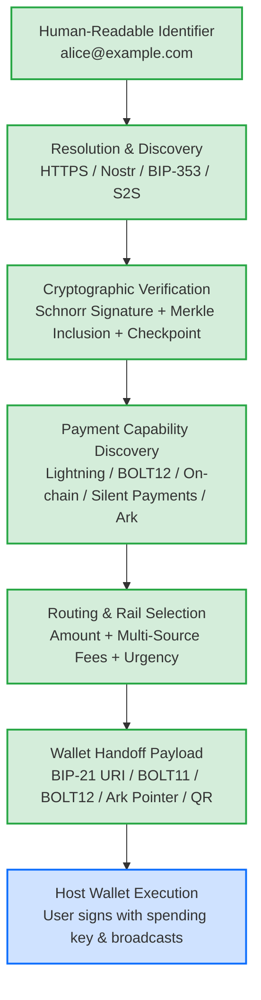
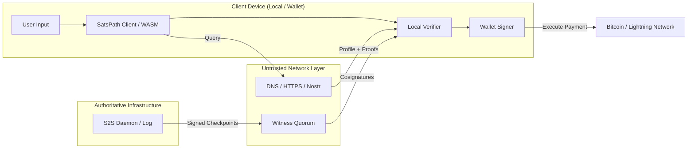

# SatsPath Architecture

SatsPath is an open-source payment discovery and routing layer for the Bitcoin ecosystem. It resolves human-readable identifiers to cryptographically authenticated payment capabilities across multiple compatible payment rails, while delegating transaction signing and execution to sovereign user wallets.

---

## 1. Core Architecture & Pipeline



### The Core Architectural Principle: Non-Custodial Separation

**SatsPath does not need, and never requests, the user's private spending keys.**

This is not a missing feature—it is an intentional **security property**:
* **No custody of funds:** SatsPath does not custody, seize, or freeze user funds.
* **No seed phrases or private keys:** SatsPath never manages BIP-39 seeds, xprv/tprv keys, or node credentials.
* **Not a wallet:** SatsPath discovers and validates payment capabilities; host wallets retain 100% control over fund authorization, coin selection, transaction signing, and network broadcast.
* **Custody Risk vs. Payment Redirection Risk:** Compromising SatsPath does not directly expose wallet spending keys or authorize Bitcoin transactions. However, a compromised discovery or handoff component may attempt payment redirection, which is why authenticated profiles, key continuity, resolver verification, and wallet-side confirmation of destination details remain security-critical.

---

## 2. Workspace Crate Architecture

The SatsPath codebase is organized as a modular Rust workspace:

```text
satspath/
├── crates/
│   ├── satspath-core/          # Protocol models, secp256k1 crypto, canonical serialization,
│   │                           # Merkle tree transparency, state map, and resolvers (HTTP, Nostr, BIP-353)
│   ├── satspath-router/        # Payment capability discovery, multi-source fee consensus,
│   │                           # BOLT12 handling, BIP-352 Silent Payments, routing heuristics, and handoff
│   ├── satspath-cli/           # Reference command-line client for development and preview flows
│   ├── satspathd/              # Authoritative server daemon, REST API, transparency endpoint, rate limiting
│   ├── satspath-witness/       # Independent witness node daemon, K-of-N checkpoint cosigning,
│   │                           # rollback and split-view detection
│   ├── satspath-wasm/          # WebAssembly bindings for browser and web wallet integrations
│   ├── satspath-swaps/         # Experimental testnet/regtest swap scaffolding (submarine/reverse)
│   └── satspath-pqc/           # Experimental post-quantum hybrid signature research module (ML-DSA-65)
├── packages/                   # TypeScript packages and verification libraries
└── proxy-workers/              # Stateless edge helper workers (e.g. Cloudflare)
```

### Crate Responsibilities & Maturity

| Crate | Maturity Status | Role & Safety Boundary |
| :--- | :--- | :--- |
| **`satspath-core`** | **IMPLEMENTED** | Core protocol primitives: profile schemas, canonical RFC 8785 JSON, `secp256k1` Schnorr signatures, append-only Merkle log, Sparse Merkle state map, and resolver chain. |
| **`satspath-router`** | **IMPLEMENTED** | Evaluates payment methods, aggregates multi-source fee estimates, formats wallet handoffs, and contains experimental BOLT12 and BIP-352 handling primitives subject to the capability-specific maturity limits documented in README.md. |
| **`satspath-cli`** | **IMPLEMENTED** | Developer tool for local profile generation, proof verification, route simulation, and QR generation. Does not execute mainnet payments. |
| **`satspathd`** | **IMPLEMENTED** | Server-to-server daemon exposing authenticated profile endpoints, transparency logs, signed checkpoints, and rate-limiting defenses. |
| **`satspath-witness`**| **IMPLEMENTED** | Lightweight monitor node that tracks daemon checkpoints, independently verifies consistency proofs, cosigns checkpoints via Schnorr signatures, and detects split views. |
| **`satspath-wasm`** | **PREVIEW** | Compiles core resolution and routing logic to WebAssembly for client-side execution in web apps and sovereign wallets. |
| **`satspath-swaps`** | **EXPERIMENTAL**| Testnet/regtest scaffolding for Boltz v2 swaps. Encrypted local store (AES-256-GCM) and claim/refund tx builders for testnet only. |
| **`satspath-pqc`** | **RESEARCH** | Research prototype testing hybrid classical + post-quantum signatures (`secp256k1` + ML-DSA-65). Not part of the production safety claim. |

---

## 3. Data Flow & Security Boundaries



### Trust Boundaries

1. **User Identity Keypair:** Generated locally on the user's device. Used exclusively to authorize public profile updates and key rotations. Never transmitted over the network.
2. **Resolver Transports:** HTTPS, Nostr, DNS, and local files are treated as untrusted transports. All returned profiles must be independently verified by the local client.
3. **Log Operator:** The log operator signs checkpoints committing to append-only history. It cannot author identity changes or key rotations without the user's private key signature.
4. **Witness Quorum:** Independent witnesses cosign operator checkpoints only after verifying append-only consistency proofs. Quorum threshold ($K$-of-$N$) ensures single-witness compromise cannot validate a split view.
5. **Host Wallet:** The host wallet remains the sovereign arbiter of funds. SatsPath provides the validated payment instructions; the wallet checks amounts, prompts the user, signs, and broadcasts.
